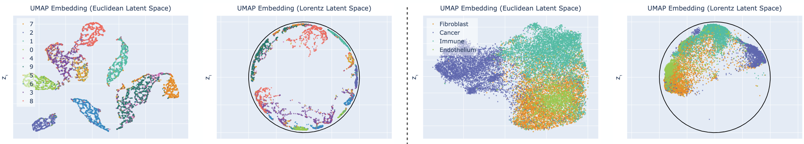
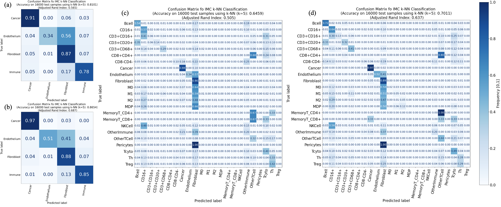
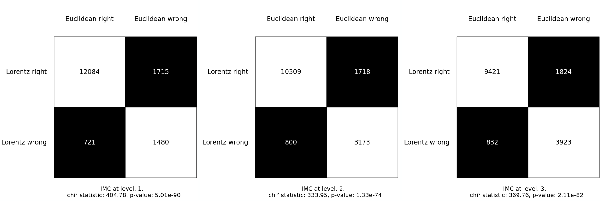
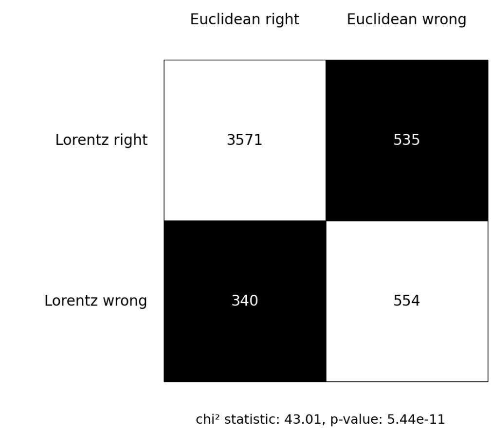

# Geometry Agnostic Evaluation Metrics - ICCV - Beyond Euclidean 2025

Official PyTorch implementation of the ICCV - Beyond Euclidean 2025 paper [Flatland and Beyond: Mutual Information Across Geometries](https://openreview.net/).

By [Youssef Wally](https://scholar.google.com/citations?user=tlZ4sG0AAAAJ&hl=en&oi=ao), [Johan Mylius-Kroken](https://scholar.google.com/citations?user=_l8mu6UAAAAJ&hl=en&oi=ao), [Michael Kampffmeyer](https://scholar.google.com/citations?user=9lDh2UgAAAAJ&hl=en&oi=ao), [Rezvan Ehsani](https://scholar.google.com/citations?user=1BhYtu0AAAAJ&hl=en&oi=ao), [Vladan Milosevic](https://scholar.google.com/citations?user=BCilR1AAAAAJ&hl=en&oi=ao), [Elisabeth Wetzer](https://scholar.google.com/citations?user=qSc3kA8AAAAJ&hl=en&oi=ao)

<p align="center">

</p>

## Introduction

**TL; DR.** In this work, we propose a geometry-agnostic mutual information framework for evaluating hyperbolic embeddings. Applied to imaging mass cytometry, Lorentzian models align best with biological hierarchies. Code for estimation and visualization is released.

**Abstract.** 
Hyperbolic representation learning has shown compelling advantages over conventional Euclidean representation learning in modeling hierarchical relationships in data. In this work, we evaluate its potential to capture biological relations between cell types in highly multiplexed imaging data, where capturing subtle, hierarchical relationships between cell types is crucial to understand tissue composition and functionality. Using a recent and thoroughly validated 42-marker Imaging Mass Cytometry (IMC) dataset of breast cancer tissue, we embed cells into both Euclidean and Lorentzian latent spaces via a fully hyperbolic variational autoencoder. We then introduce an information-theoretic framework based on k-nearest neighbor estimators to rigorously quantify the clustering performance in each geometry using mutual information and conditional mutual information. Our results reveal that hyperbolic embeddings retain significantly more biologically relevant information than their Euclidean counterparts. We further provide open-source tools to extend Kraskov-Stögbauer-Grassberger based mutual information estimation to Lorentzian geodesic spaces, and to enable UMAP visualizations with hyperbolic distance metrics. This work contributes a principled evaluation method for geometry-aware learning and supports the growing evidence of hyperbolic geometry's benefits in spatial biology.

**This repository.** In this repository, we provide implementations of the main experiments from our paper using the MNIST dataset. Moreover, we provide a fully functional [library] that provides all our Geometry-Agnostic Metrics. This includes:

- Calculating Space corresponding Distances (Adapted from [HCNN](https://github.com/kschwethelm/HyperbolicCV/tree/main?tab=readme-ov-file))
- Using UMAP with each corresponding distance
- Using kNN with each corresponding distance
- Continouse score for hierarchal labels based on least common ancestor (LCA)
- Mutual Information as a comparable metric across different geomertries
- Classical Clustering Metrics using Lorentz distance instead of Euclidean:
   - Lorentz silhouette score
   - Lorentz davies bouldin index

**Note.** The curvature K is defined differently in our paper, in [HCNN](https://github.com/kschwethelm/HyperbolicCV/tree/main?tab=readme-ov-file) and in [Geoopt](https://github.com/geoopt/geoopt) -> K = -1/K.

## License

This code is released under the [MIT License](LICENSE).

## Citing our work

If you find our work useful for your research, please cite our paper as follows:

```bibtex
PENDING
```

## Results

### Mutual Information

In this experiment, we estimate the MI between the Lorentzian distance matrix and the class labels, $I(D_L; C)$, and between the Euclidean distance matrix and the class labels, $I(D_E; C)$, where $D_L$ and $D_E$ are the pairwise distance matrices computed under Lorentzian and Euclidean metrics, respectively, and $C$ denotes the discrete class labels. Additionally, we compute the MI between the two distance matrices themselves, $I(D_L; D_E)$, to understand how much geometric information is shared between the two representations. To further probe the complementarity of the geometries, we compute two conditional MI quantities: $I(D_L; C \mid D_E)$, which captures the incremental information that Lorentz geometry provides about the labels beyond what is already explained by Euclidean structure, and $I(D_E; C \mid D_L)$, which evaluates the converse.

Table 1: Estimated MI and CMI on IMC and MNIST test sets..

| **Quantity**         |   **IMC**   |   **MNIST**  |
|-----------------|:------------:|:------------:|
| $I(D_L; C)$   | **1.07** | **1.86** |
| $I(D_E; C)$  | 0.96 | 1.76 |
| $I(D_L; D_E)$  | 0.01 | 4.03 |
| $I(D_L; C \mid D_E)$ | **1.06** | **0.16** |
| $I(D_E; C \mid D_L)$| 0.00 | 0.09 |

### knn Confusion Matrix

In this experiment, we leverage the pairwise distance matrices—computed using the appropriate geometry to train a k-nearest neighbors (kNN) classifier.

Figure 1: k-nearest neighbor (kNN) classifier results on the IMC test set. (a) Euclidean representations with labels at level 1, (b) Lorentz 
representations with labels at level 1, (c) Euclidean representations with labels at level 3, and (d) Lorentz representations with labels at 
level 3.

<p align="center">

</p>

### McNemar Test

In this experiment, we leverage the kNN Classifier to Calculate the McNemar Test.

Figure 2: McNemar test between the Euclidean model and Lorentz model predictions on IMC dataset.

<p align="center">

</p>

Figure 3: McNemar test between the Euclidean model and Lorentz model predictions on MNIST dataset.

<p align="center">

</p>

## Installation

### Requirements

- Python>=3.8

   We recommend using [Anaconda](https://www.anaconda.com/docs/getting-started/anaconda/install):

   ```bash
   conda create -n FlatlandAndBeyond python=3.8 pip
   conda activate FlatlandAndBeyond
   ```

- [PyTorch](https://pytorch.org/get-started/locally/).

- Additional requirements:
   ```bash
   pip install -r requirements.txt
   ```

## Usage

You can follow the steps in the [Example](https://github.com/youssefwally/FlatlandandBeyond/blob/main/GeometriclyAgnosticEvaluation/Notebooks/examples.ipynb).